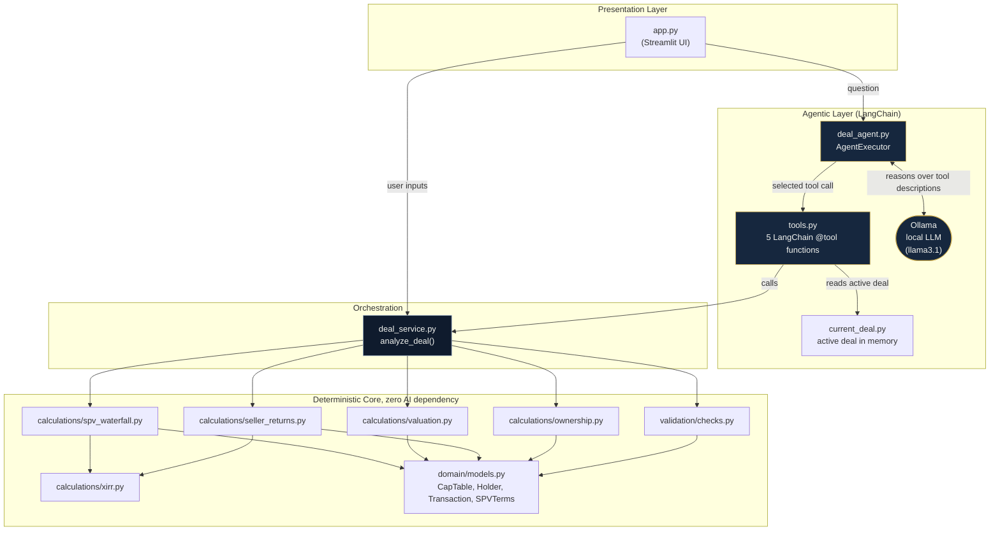
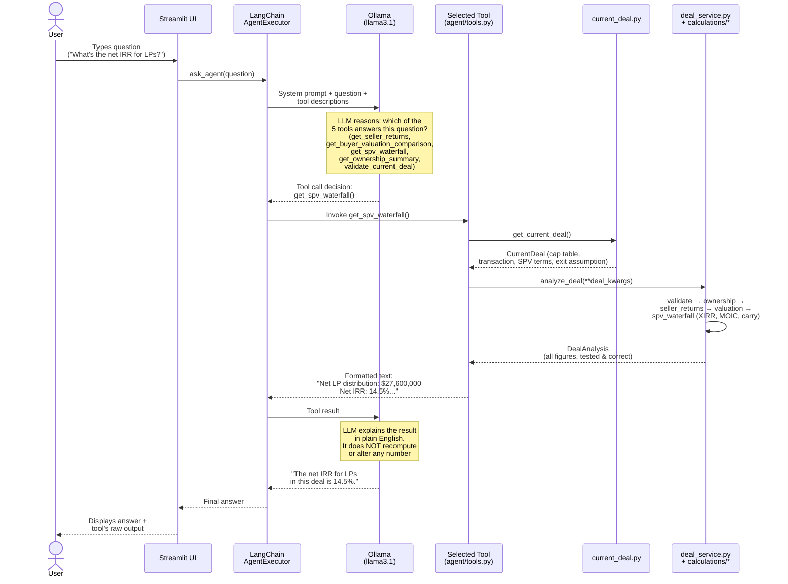
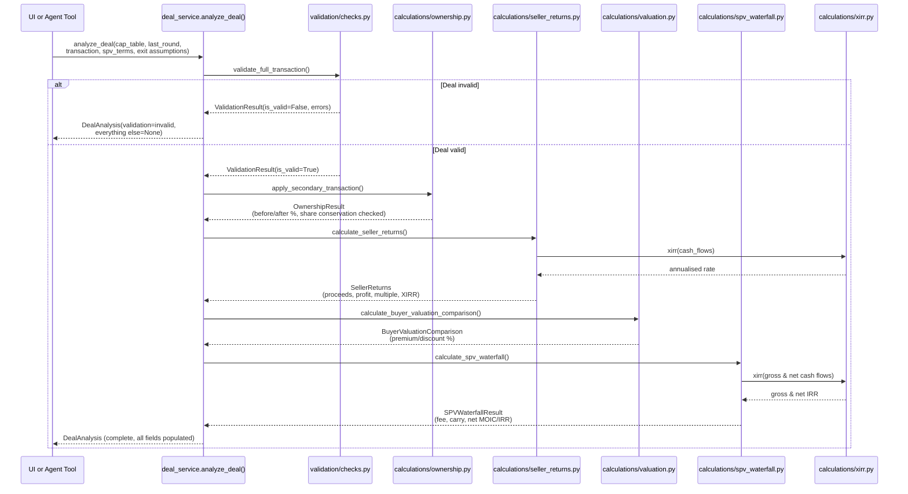

# Architecture

This document describes the system architecture: the component
structure, the data flow through a deal analysis, and, in particular
detail since it is the most novel part of the system, the LangChain
agentic workflow that powers "Ask the Deal Agent."

---

## 1. Component architecture

The system is layered so that the **deterministic financial core has
zero dependency on AI**. The UI and the AI agent are both thin clients
of the same `deal_service.analyze_deal()` function. Neither one
re-implements any financial logic.

**Key architectural rule:** every arrow flowing *into* the
"Deterministic Core" comes from `deal_service.py`. Nothing in the
Agentic Layer or Presentation Layer calls a calculation function
directly. They always go through the same orchestrator, so the UI,
the tests, and the AI agent are provably looking at the same numbers.

---

## 2. The LangChain agentic workflow (detail)

This is the sequence that runs when a user types a question into "Ask
the Deal Agent." It is the most important flow to understand, because
it's the mechanism that enforces the project's core rule: **the LLM
never calculates a financial figure. It only selects a tool and
explains that tool's already-correct output.**

**Why this design matters for a financial tool:** if the LLM were
allowed to reason about the numbers directly (rather than only
selecting a tool), a hallucinated or slightly-off figure could enter
the answer with no way to detect it. By constraining the LLM to
*tool selection and explanation only*, every number in the final
answer is guaranteed to trace back to a tested function in
`calculations/`, the same functions covered by the 19 tests in
`tests/`.

---

## 3. Data flow for a full deal analysis

This is the sequence for a single "Analyze Deal" pass. It is the same
whether it's triggered by the Streamlit UI on page load/input change,
or indirectly by an agent tool call.

---

## 4. Why the deterministic core has no AI dependency

This isn't an accident. It is the central design constraint of the
project (see `ASSUMPTIONS.md` for the full reasoning). Concretely, it
means:

- `domain/`, `calculations/`, and `validation/` import nothing from
  `langchain`, `langchain_ollama`, or any AI library
- Every function in `calculations/` is a **pure function**: same
  inputs always produce the same outputs, with no hidden state,
  network calls, or randomness
- The 19 tests in `tests/` exercise this core directly, with no LLM
  involved. They would pass identically with Ollama uninstalled
- The AI agent (`agent/`) is architecturally a *client* of this core,
  in exactly the same sense that the Streamlit UI is a client of it
